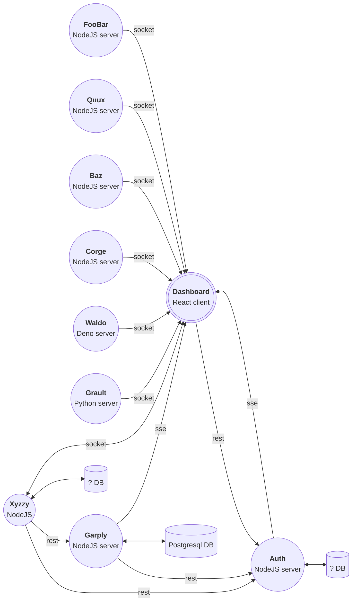

# Dashboard

WIP study project having multiple servers sending messages to a React client using:

- sockets (socket IO)
- server sent events

```mermaid
flowchart LR
  FooBar(("`__FooBar__
  NodeJS server`"))
  Quux(("`__Quux__
  NodeJS server`"))
  Baz(("`__Baz__
  NodeJS server`"))
  Corge(("`__Corge__
  NodeJS server`"))
  Waldo(("`__Waldo__
  Deno server`"))
  Grault(("`__Grault__
  Python server`"))
  Dashboard((("`__Dashboard__
  React client`")))
  FooBar--socket-->Dashboard
  Quux--socket-->Dashboard
  Baz--socket-->Dashboard
  Corge--socket-->Dashboard
  Waldo--socket-->Dashboard
  Grault--socket-->Dashboard
  Auth(("`__Auth__
  NodeJS server`"))
  Garply(("`__Garply__
  NodeJS server`"))
  Xyzzy(("`__Xyzzy__
  NodeJS`"))
  AuthDB[(? DB)]
  XyzzyDB[(? DB)]
  GarplyDB[(Postgresql DB)]

  Auth<-->AuthDB
  Auth--sse-->Dashboard
  Dashboard--rest-->Auth
  Garply--rest-->Auth
  Garply<-->GarplyDB
  Garply--sse-->Dashboard
  Xyzzy--rest-->Auth
  Xyzzy--rest-->Garply
  Xyzzy<-->XyzzyDB
  Xyzzy<--socket-->Dashboard

```
